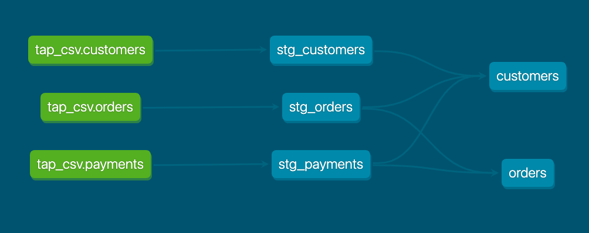
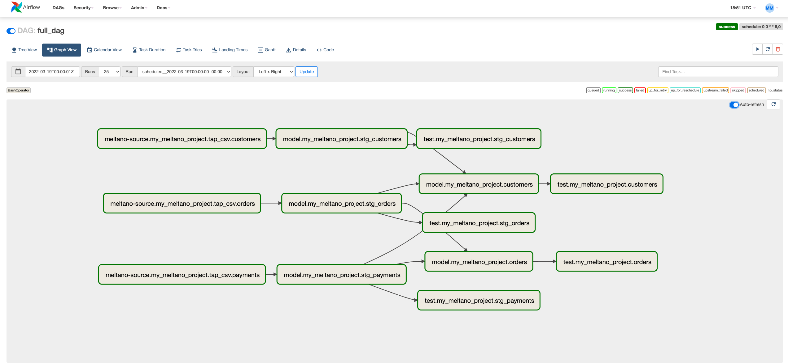
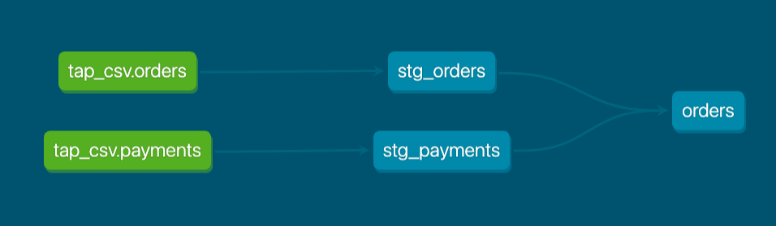
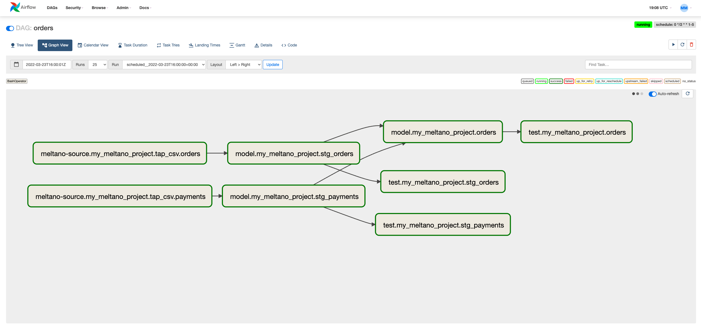

# Meltano x dbt Jaffle Shop

This project is based on the dbt's classic [Jaffle shop example project](https://github.com/dbt-labs/jaffle_shop) but in a Meltano context.

The Airflow DAG generator code [files-airflow-dbt](https://gitlab.com/pnadolny13/files-airflow-dbt) that fuels this functionality is :warning: **Experimental** :construction: and being reviewed in the [Merge Request](https://gitlab.com/meltano/files-airflow/-/merge_requests/8) with more in depth discussion taking place in this [issue](https://gitlab.com/meltano/files-airflow/-/issues/7).

We're looking for feedback so feel free to jump into the issue and leave comments!

### What is this repo?

A Meltano project to share the benefits of running dbt core within a Meltano project.
It can also serve as an example of how to configure your own Meltano project.

The idea is to use dbt's Jaffle shop example project but instead of using dbt seed to load the data into your warehouse (aka local Postgres instance) you will use tap-csv and target-postgres to simulate how to use Singer as a EL tool.

### What's contained in this project?

The Meltano project has the following plugins installed and configured:

- EL
    - tap-csv (Singer)
    - target-postgres (Singer)
- Transformation
    - dbt
- Orchestration
    - Airflow


Features we'll specifically explore is the ability to schedule dbt models to run in Airflow at model level precision.
We will set DAG definitions, like the one below, using dbt selection syntax that automatically generate Airflow DAGs at the model level, including the Meltano EL sync that feeds the dbt source table. The DAG definitions configuration file is a custom file thats not part of the Airflow, dbt, or Meltano spec. A version of the `dags` key will likely be added to `meltano.yml` in the near future, at that point this can be migrated there.

```yaml
dags:
  dag_definitions:
    # Example DAGs to show how you might want to schedule different models in a more precise way
    full_dag:
      # Weekends - Full DAG once a day end to end
      generator: dbt
      interval: '0 0 * * 6,0'
      selection_rule: '*'
```

It translates the dbt lineage graph from the Jaffle shop example that looks like this:




Into Airflow DAGs where each model is an Airflow task and dbt tests are run following the model.




Further we can configure [dbt graph operators](https://docs.getdbt.com/reference/node-selection/graph-operators) like `+orders` to define how the Airflow DAG should render, in this case all upstream of the `orders` model:

```yaml
dags:
  dag_definitions:
    orders:
      # Orders consumption model and all upstream, every 2 hrs only on weekdays
      generator: dbt
      interval: '0 */2 * * 1-5'
      selection_rule: '+orders'
```

The dbt lineage graph given the selection criteria looks like this:



Becomes an Airflow DAG that looks like this:



### How to run this project?

1. Clone this repo:

    ```bash
    git clone https://github.com/pnadolny13/meltano_example_implementations.git
    cd meltano_example_implementations/meltano_projects/dbt_orchestration/
    ```

1. Install Meltano:

    ```bash
    meltano install
    ```

1. Start a local Postgres docker instance.
It will contain a database called `warehouse` that we'll send our raw data to.

    ```bash
    docker run --rm --name postgres -e POSTGRES_PASSWORD=meltano -e POSTGRES_USER=meltano -e POSTGRES_DB=warehouse -d -p 5432:5432 postgres
    ```

1. Create a `.env` file and add database secrets. This is mostly to encourage best practices since were using a local Postgres instance we don't have any sensitive credentials.

    ```bash
    touch .env
    echo PG_PASSWORD="meltano" >> .env
    ```

1. Run the EL pipeline using Meltano

    ```bash
    meltano --environment=dev run tap-csv target-postgres
    ```

    You should now see data in your Postgres database.

1. Compile your dbt project so your manifest.json is available for informing how to generate Airflow DAGs.

    ```bash
    meltano --environment=dev run dbt:compile
    ```

1. Start Airflow as a background process.
Also this creates an Airflow users called `melty`.

    ```bash
    meltano --environment=dev invoke airflow webserver -D
    meltano --environment=dev invoke airflow users create --username melty --firstname melty --lastname meltano --role Admin --password melty --email melty@meltano.com
    meltano --environment=dev invoke airflow scheduler -D
    ```

    You'll notice that a [generator_cache.yml](./orchestrate/sample.generator_cache.yml) file will get created which caches your selection criteria results, Meltano schedules, and dbt manifest.json content.

    To kill the background Airflow processes run:

    ```bash
    pkill -f airflow
    ```

1. Generate and serve your the dbt docs.

    ```bash
    meltano --environment=dev invoke dbt docs generate
    # Uses a custom port so it doesnt collide with the Airflow webserver
    meltano --environment=dev invoke dbt docs serve --port 8081
    ```

1. Explore the UIs! Turn on the DAGs that your want to run and watch them create Postgres views.

    - Airflow - http://0.0.0.0:8080/home
    - dbt Docs - http://0.0.0.0:8081

    Try updating [dag_definition.yml](./orchestrate/dag_definition.yml) to add a DAG or update dbt select criteria.
    Remember to delete the [generator_cache.yml](./orchestrate/sample.generator_cache.yml) (links to the sample file) file when you make changes to the dbt project or schedules, it will get re-created automatically.

1. Explore the analysis utilities.
This will analyze the selection criteria across all DAGs and let you know if any models are accidentally not selected.
You can try commenting out `full_dag` and `orders` from [dag_definition.yml](./orchestrate/dag_definition.yml) and re-running to see the output when models are not selected.

    ```bash
    python orchestrate/dags/dbt_analyze.py
    ```
